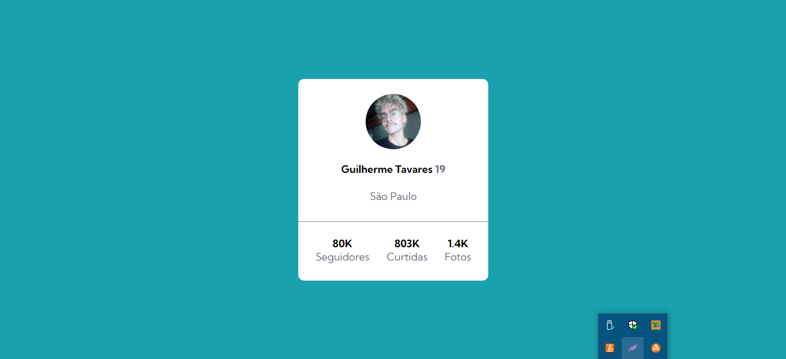
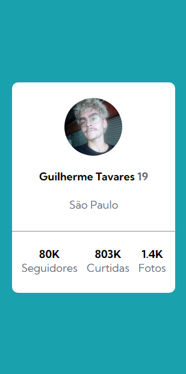

# Cartão de Perfil
Um simples exercício de um cartão de perfil, utilizando CSS com design flexbox! 🚀

[](https://google.com)

[](https://google.com)

## Tecnologias Utilizadas
- HTML
- CSS

## Como Utilizar

1 - Clone o projeto
```
git clone <url>
```

2 - Acesse a pasta do projeto

```
cd 04-cartao-de-perfil
```